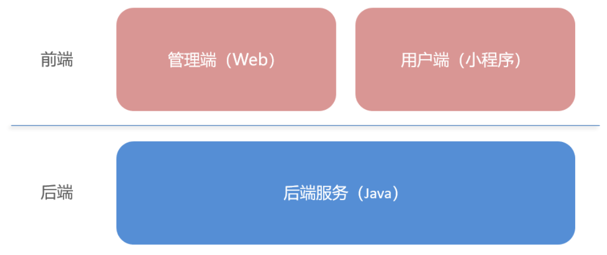
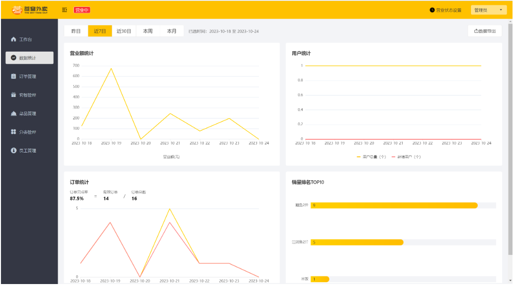
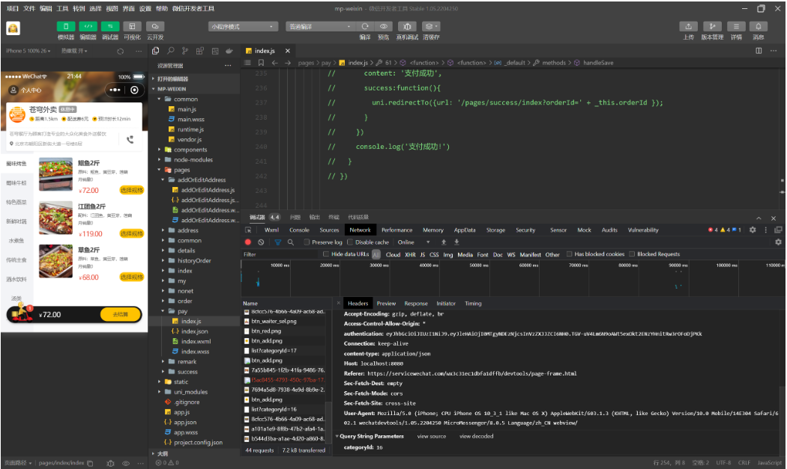
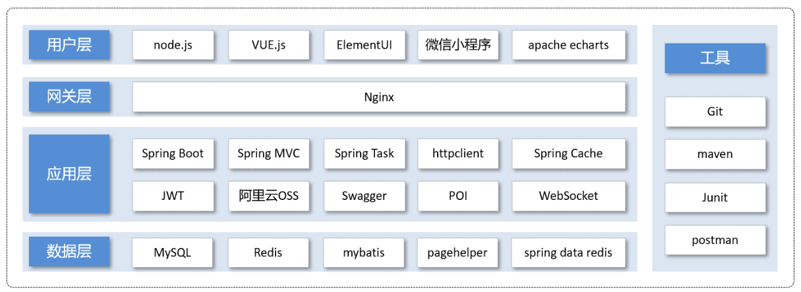

这是IT黑马的苍穹外卖项目代码实现！<br>
黑马官网：[ITCAST](https://www.itheima.com/)<br>
BiliBili视频跳转：[苍穹外卖](https://www.bilibili.com/video/BV1TP411v7v6/?spm_id_from=333.1007.top_right_bar_window_history.content.click&vd_source=fcf444dc195fc74fe6d50f9fa7d48a22)

# 项目介绍
这是一款为餐饮类企业定制的软件产品，分为管理端和用户端。实现用户端点单，管理端处理订单的简易外卖软件。<br>
项目的整体架构分为前端和后端，开发模式为前后端分离开发模式：
<div align=center></div>
<center>管理端</center>
<div align=center></div>
<center>用户端</center>
<div align=center></div>

# 技术选型
<div align=center></div>

## 用户层
```
商家端：
    简单的网页，使用了前端三件套，以及ElementUI，apache，echarts等技术。
用户端：
    基于微信小程序进行开发。
```
## 网关层
```
Nginx：
    使用Nginx来部署前端。
    这是一款高性能Web开源服务器，在大型项目中，我们可以使用Nginx的负载均衡来合理请求到多台服务器，减小后端服务器压力。
```
## 应用层
```
Spring boot：
    基于Spring的开源框架，简化各项配置，使得开发人员专注于业务功能的实现。
Spring MVC：
    基于MVC（Model-View-Controller）模式的Web应用程序开发框架。
    它提供了一种结构清晰、模块化的方式来构建可扩展的Web应用程序。
Spring Task：
    定时任务依赖，完成相关配置，后端可以定时完成任务。
Httpclient：
    HTTP开源的通信库，使得后端可以发送和处理后端请求，常用于后端请求各种接口时用到。
Spring Cache:
    缓存依赖，把数据存储到缓存中，如果前端再次请求相同数据，使得后端可以从缓存中拿数据，减少了对数据库的IO操作，降低了后端服务器的压力。
JWT：
    令牌技术，校验用户身份。
阿里云OSS：
    第三方云存储技术，后端调用阿里云OSS来存储菜品等图片。
Swagger：
    开源框架，实现设计、构建和测试RESTful API的开源框架。
    在本项目中，使用的是Swagger的优化版本Knife4j，它基于注解的方式注解在启动类上，在后端启动之后，在网页输入localhost 8080/doc.html就可以打开相关接口管理界面。
POI：
    读取和写入Microsoft Office格式文件，如Word文档、Excel电子表格和PowerPoint演示文稿。
WebSocket：
    一种通信协议，允许客户端与服务器进行持久化连接，并且区别于请求-响应模式，WebSocket协议实现了客户端与服务器的双向通信。
```
## 数据层
```
MySQL：
    关系型存储系统，基于表的形式对数据进行存储，直接存储数据到磁盘当中。
Redis：
    键值型存储系统，基于键值对的形式对数据进行存储，数据会被存储到缓存当中。
Mybatis：
    开源的持久层框架，简化了java与关系型数据的之间的操作。
pagehelper：
    分页框架，以注解的形式使用，简化分页查询中的分页查询操作。
spring data redis：
    spring框架提供的与Redis数据库进行交互的模块，简化在java中使用Redis的操作步骤。
```
## 工具
```
Git：
    分布式文件管理工具，追踪管理文件变化，适用于多人开发。

maven：
    开源的项目管理工具，用于构建和管理Java项目。
    它提供了一种标准化的项目结构和构建过程，使得开发人员可以更容易地管理项目依赖、构建项目、运行测试和部署应用程序。
Junit:
    Java开源单元测试框架，可以对指定方法进行单元测试，简化开发人员测试流程。
postman：
    接口测试工具，可以便捷的代替前端对后端发送各种请求，测试接口运行效果。

```
# 项目功能

## 管理端：
|  模块   |                     描述                     |
|:-------:|:------------------------------------------:|
| 登录/退出 |           内部员工必须登录后，才可以访问系统管理后台           |
| 员工管理 |    管理员可以在系统后台对员工信息进行管理，包含查询、新增、编辑、禁用等功能    |
| 分类管理 | 主要对当前餐厅经营的菜品分类或套餐分类进行管理维护，包含查询、新增、修改、删除等功能 |
| 菜品管理 |   主要维护各个分类下的菜品信息，包含查询、新增、修改、删除、启售、停售等功能    |
| 套餐管理 |   主要维护当前餐厅中的套餐信息，包含查询、新增、修改、删除、启售、停售等功能    |
| 订单管理 | 主要维护用户在移动端下的订单信息，包含查询、取消、派送、完成，以及订单报表下载等功能 |
| 数据统计 |        主要完成对餐厅的各类数据统计，如营业额、用户数量、订单等        |
## 用户端：
|  模块   |                     描述                     |
|:-------:|:------------------------------------------:|
| 登录/退出 |           用户需要通过微信授权后登录使用小程序进行点餐           |
| 点餐-菜单 |    在点餐界面需要展示出菜品分类/套餐分类， 并根据当前选择的分类加载其中的菜品信息，供用户查询选择    |
| 点餐-购物车 | 用户选中的菜品就会加入用户的购物车，主要包含 查询购物车、加入购物车、删除购物车、清空购物车等功能 |
| 订单支付 |   用户选完菜品/套餐后，可以对购物车菜品进行结算支付，这时就需要进行订单的支付    |
| 个人信息 |   在个人中心页面中会展示当前用户的基本信息，用户可以管理收货地址，也可以查询历史订单数据    |
